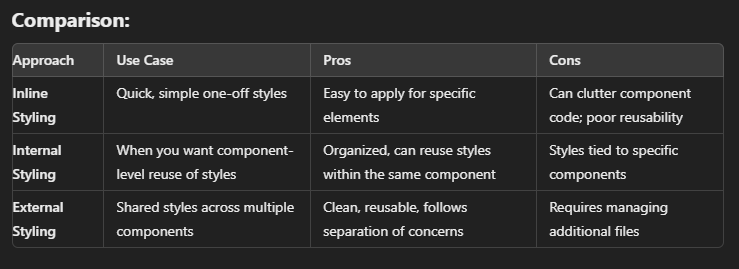

# React Native Guide

### Creating a New App
### To create a new React Native app using Expo, you can use the following command:

```bash
npx create-expo-app@latest
```

### If Expo Go isn't working, you can try reinstalling the CLI globally:

```bash
npm install -g expo-cl
```


# Making Components

### In React Native, components are reusable pieces of UI.

### Here's an example of how to create and use a simple component:

### Create a component Greet.tsx:
### Example 1
```tsx
// Greet.tsx
import { Text } from "react-native";
import React from "react";

const Greet = () => {
  return <Text>Hello, welcome to the app!</Text>;
};

export default Greet;
```
### Example 2
```tsx
import { Text } from "react-native";
import Greet from "../components/Greet.tsx";

const Index = () => {
  return <Greet />;
};
export default Index;
```

## Using the components

### Example 1
```tsx
import { View, Text } from "react-native";
import React from "react";

import Name from "../../components/Namec";
import Twitter from "../../components/Twitter";
import Job from "../../components/job";
import Age from "../../components/greet";

const index = () => {
  return (
    <View>
      <Text>index</Text>
      <Name />
      <Job />
      <Age />
      <Twitter />
    </View>
  );
};

export default index;
```
### Example 2
```tsx
// Index.tsx
import React from "react";
import Greet from "../components/Greet.tsx";

const Index = () => {
  return <Greet />;
};

export default Index;
```
### View acts like the div in HTML (used for layout).
### Text is used to display text elements.

# Buttons in React native

### Buttons are a fundamental UI element in any app. Here's how to use them in React Native:

```tsx
import { View, Text, Button } from "react-native";
import React from "react";

const Button1 = () => {
  return (
    <View>
      <Text>button</Text>
      {/* Events */}
      <Button title="Start now" color="red" />

      <Button
        title="Click me"
        color="blue"
        onPress={() => console.log("Button 2 Pressed")}
      ></Button>
    </View>
  );
};

export default Button1;
```
# Pressables in React Native

### Pressable is a more flexible component than Button.

It lets you handle more gestures like onPress, onPressIn, onLongPress, etc.

It's highly customizable for building complex interactions.

### 1. onPress: function that is called when the button is Pressed

### 2. onPressIn: function is called when the press gesture starts

### 3. onPressOut: function is called when the press gesture ends or cancelled

### 4. onLongPress: function is called when a long press is detected

### Example 1
```tsx
import { View, Text, Pressable } from 'react-native';
import React from 'react';

const PressableButton = () => {
  return (
    <View>
      <Pressable onPress={() => console.log("OnPressed")} style={{ marginBottom: 20 }}>
        <Text>          OnPress</Text>
      </Pressable>
      
      <Pressable onPressIn={() => console.log("OnPressIn")} style={{ marginBottom: 20 }}>
        <Text style={{ color: "brown" }}>           OnPressIn</Text>
      </Pressable>

      <Pressable onPressOut={() => console.log("OnPressOut")} style={{ marginBottom: 20 }}>
        <Text style={{ color: "blue" }}>            OnPressedOut</Text>
      </Pressable>

      <Pressable onLongPress={() => console.log("OnLongPress")}>
        <Text style={{ color: "blue" }}>            OnLongPress</Text>
      </Pressable>
    </View>
  );
};

export default PressableButton;
```
### Example 2
```tsx
import { View, Text, Pressable } from 'react-native';
import React from 'react';

const PressableButton = () => {
  return (
    <View>
      {/* onPress Event */}
      <Pressable onPress={() => console.log("OnPressed")} style={{ marginBottom: 20 }}>
        <Text>OnPress</Text>
      </Pressable>
      
      {/* onPressIn Event */}
      <Pressable onPressIn={() => console.log("OnPressIn")} style={{ marginBottom: 20 }}>
        <Text style={{ color: "brown" }}>OnPressIn</Text>
      </Pressable>

      {/* onPressOut Event */}
      <Pressable onPressOut={() => console.log("OnPressOut")} style={{ marginBottom: 20 }}>
        <Text style={{ color: "blue" }}>OnPressOut</Text>
      </Pressable>

      {/* onLongPress Event */}
      <Pressable onLongPress={() => console.log("OnLongPress")}>
        <Text style={{ color: "blue" }}>OnLongPress</Text>
      </Pressable>
    </View>
  );
};

export default PressableButton;
```
# Images in React Native
### React Native provides the Image component to display images in your app. 

You can load images from various sources like local files, network URLs ( uri ), or static resources.

```tsx
import { View, Text, Image } from 'react-native'
import React from 'react'
const Images = () => {
  return (
<View style={{ flex: 1 }}>
      <Text style={{color:"blue",padding:20}}>Images</Text>
      <Image source={require("../assets/image.png")}  style={{ margin: 20,width:150,height:150,borderRadius: 20}}/>
      <Image source={
        {
          uri:"https://avatars.githubusercontent.com/u/129139486?s=400&u=ab1e36746498ac43c783da0baae0363aaffa8d16&v=4"
        }
    } 
      style={{margin:20,width:150,height:150,borderRadius: 20}}/>
    </View>
  )
}
export default Images
```
<!--  -->
 &nbsp;

# Dynamic Content Rendering
The typescript way 
```tsx
import { View, Text } from "react-native";
import React from "react";

const Dynamic = () => {
  const username = "Vaibhav Kothari";
  const age = "19";
  const multi = (a: number, b: number) => a * b;
  return (
    <View>
      <Text style={{textAlign:"center"}}>My name is {username}</Text>
      <Text style={{textAlign:"center"}}>My age is {age}</Text>
      <Text style={{textAlign:"center"}}> 3 * 6 = {multi(3,6)}</Text>
      <Text style={{textAlign:"center"}}> 3 + 6 = {3+6}</Text>
    </View>
  );
};
export default Dynamic;
```


# Styling your app through css
### 1. Inline css
```tsx
import { View, Text } from "react-native";
import React from "react";

const Dynamic = () => {
  return (
    <View>
      <Text style={{textAlign:"center",width:100,height:200,color:"red",backgroundColor:"blue"}}>My name is Vaibhav Kothari</Text>
    </View>
  );
};
export default Dynamic;
```

### 2. Internal css

```tsx
import { View, Text, StyleSheet } from 'react-native';

const InternalStyleExample = () => {
  return (
    <View style={styles.container}>
      <Text style={styles.text}>Internal Styled Text</Text>
    </View>
  );
};

const styles = StyleSheet.create({
  container: {
    padding: 20,
    backgroundColor: '#f8f8f8',
  },
  text: {
    color: 'blue',
    fontSize: 20,
  },
});

export default InternalStyleExample;

```
### 3. External css
style.ts 
```ts
import {StyleSheet} from 'react-native';
const st = StyleSheet.create({
    textStyle:{
        color:"white",
        fontSize:30,
        backgroundColor:"red",
        margin:20,
        padding:20
    },
    lineStyle:{
        color:"white",
        fontSize:30,
        backgroundColor:"red",
        margin:20,
        padding:20
    }
})
export default st;
```
External.tsx to use that css code
```tsx
import { View, Text, StyleSheet } from 'react-native'
import st from '../utils/styles'

const External = () => {
  return (
    <View>
      <Text style={st.textStyle}>External</Text>
      <Text style={st.lineStyle}>CSS</Text>
    </View>
  )
}

export default External
```


### 4. TailWind css
Install Dependencies
```bash
npm install tailwindcss-react-native
npm install --save-dev @types/tailwindcss-react-native

```
Configure Tailwind
```bash
npx tailwindcss init
```
Then change this accroding to your structure

```js
module.exports = {
  content: [
    './App.{js,jsx,ts,tsx}',
    './src/**/*.{js,jsx,ts,tsx}',  // Adjust based on your folder structure
  ],
  theme: {
    extend: {},
  },
  plugins: [],
}
```
Then start using tailwind
```tsx
import React from 'react';
import { View, Text } from 'react-native';
import { tailwind } from 'tailwindcss-react-native';

const TailwindExample = () => {
  return (
    <View style={tailwind('flex-1 justify-center items-center bg-blue-100')}>
      <Text style={tailwind('text-xl text-blue-600')}>Hello, Tailwind!</Text>
    </View>
  );
};

export default TailwindExample;
```

# Rendering data from list or object using ListData
```tsx
import { View, Text, FlatList } from "react-native";
import React from "react";

const ListData = () => {
  const fruits = ["Apple", "Banana", "Orange","Grapes","Watermelon"];
  return (
    <View>
      <FlatList
        data={fruits}
        keyExtractor={(item) =>item} // to get the unique keys
        renderItem={({ item }) => {
            return <Text style={{textAlign:"center"}}>{item}</Text>
        }}
      />
    </View>
  );
};

export default ListData;
```

### Objects

```tsx
import { View, Text, FlatList } from "react-native";
import React from "react";

const ListData2 = () => {
    const city = [
      {
        id: 1,
        location: "London",
      },
      {
        id: 2,
        location: "Jaipur",
      },
      {
        id: 3,
        location: "Delhi",
      }
];
    return (
      <View>
        <FlatList
          keyExtractor={(item) => item.id.toString()}
          data={city}
          renderItem={({ item }) => {
          return <Text>{item.location}</Text>}}
        />
      </View>
    );
  };

export default ListData2;
```

### rendering huge item through render function and flatlist
render function
rember to return the view or change the brackets {} to ()
```tsx

interface Product{
  image:string;
  name:string;
  rating:number;
  price:number;
}
  const renderItem = ({ item } : {item : Product}) => {
    return (
      <View>
        <Image source={{ uri: item.image }} />
        <Text>Name: {item.name}</Text>
        <Text>Rating: {item.rating}</Text>
        <Text>Price: {item.price}</Text>
      </View>
    );
  };

```
```tsx
  <View>
      <FlatList data = {products}
        keyExtractor={(item,index) => index.toString()}
        renderItem={renderItem}
        />
    </View>
```

